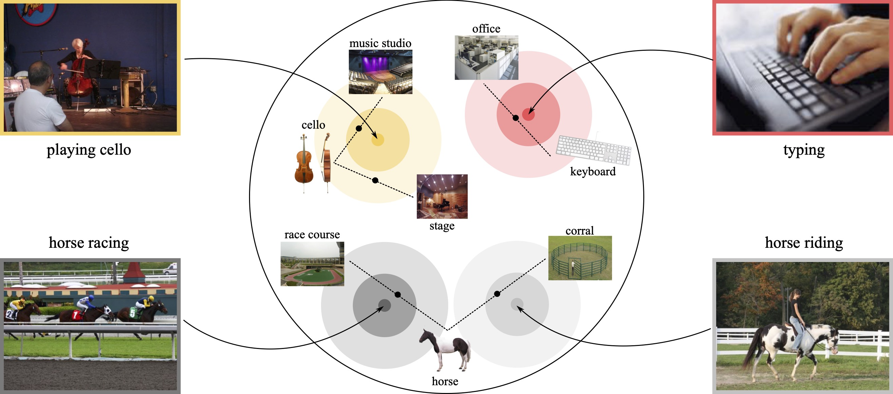

# Diverse Object-Scene Compositions For Zero-Shot Action Recognition

This repository contains the source code for the use of object-scene compositions for zero-shot action recognition.



This repository includes:
* object and scene predictions for UCF-101, UCF-Sports, J-HMDB
* script to retrieve object and scene predictions for Kinetics
* scripts to obtain word and sentence embeddings for all datasets used and for object-scene compositions
* script to obtain action predictions from any given action dataset, given the object and scene predictions and the respective action labels 


## Software used
* python 3.8.8
* pytorch 1.7.1 
* numpy 1.19.2
* fasttext 0.9.2
* sentence-transformers 1.2.0
* scikit-learn 0.24.1

## Downloading the object and scene predictions for Kinetics

While the action labels and video annotations for Kinetics are already present in the repo, the object and scene predictions need to be retrieved using:
```
bash kineticsdownload.sh
```

## Obtaining word and sentence embeddings for all datasets

To compute the word and sentence embeddings for all the video and image datasets run:
```
python getfasttextembs.py; python getbertembs.py
```

This will additionally compute the embeddings for all object-scene compositions and the similarities between all action labels and objects-scene compositions.

## Using the main script
The main script can be run using the default arguments as follows:
To compute the word and sentence embeddings for all the video and image datasets run:
```
python zero-shot-actions.py
```

There are several flags that can be used. Descriptions for these can be shown by running:
```
python zero-shot-actions.py --help
```

Lastly, a helper function to compute results for different datasets and for different flag values is available:
```
python make_results.py
```
